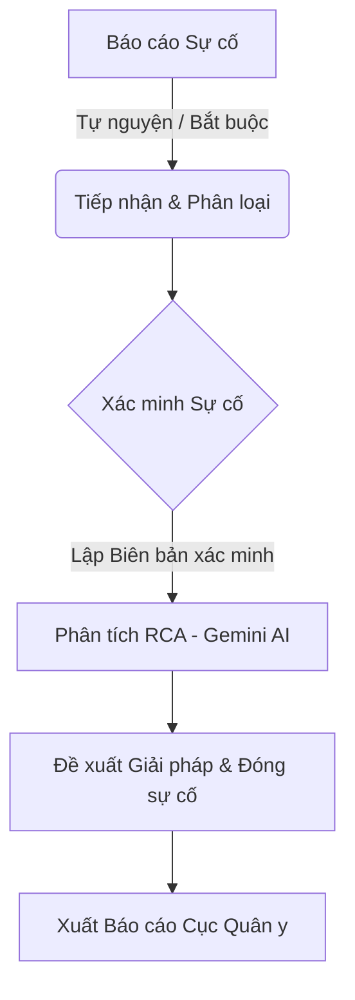

# Tài liệu Hướng dẫn Sử dụng Chi tiết Hệ thống QLCL-v3
## Bệnh viện Quân y 103

Chào mừng bạn đến với hướng dẫn sử dụng chi tiết hệ thống **QLCL-v3** - Hệ thống Hỗ trợ Quản lý Chất lượng và An toàn Người bệnh toàn diện, được thiết kế riêng cho Bệnh viện Quân y 103.

Hệ thống được phát triển trên nền tảng **React (Vite)** hiện đại, cơ sở dữ liệu thời gian thực **Supabase**, và tích hợp trí tuệ nhân tạo **Gemini AI** nhằm tự động hóa quy trình nghiệp vụ Quản lý chất lượng (QLCL) theo quy định của Bộ Y tế và Cục Quân y.

---

## MỤC LỤC
1. [TỔNG QUAN & PHÂN QUYỀN TRUY CẬP](#1-tổng-quan--phân-quền-truy-cập)
2. [HƯỚNG DẪN CHI TIẾT 9 MODULE NGHIỆP VỤ](#2-hướng-dẫn-chi-tiết-9-module-nghiệp-vụ)
   - [Module 1: Dashboard (Trang chủ & Tổng quan)](#module-1-dashboard-trang-chủ--tổng-quan)
   - [Module 2: Quản lý Nhân sự (HR)](#module-2-quản-lý-nhân-sự-hr)
   - [Module 3: Văn bản & Đào tạo (Docs)](#module-3-văn-bản--đào-tạo-docs)
   - [Module 4: Đánh giá Chất lượng (83 Tiêu chí)](#module-4-đánh-giá-chất-lượng-83-tiêu-chí)
   - [Module 5: Quản lý Sự cố Y khoa (Incidents)](#module-5-quản-lý-sự-cố-y-khoa-incidents)
   - [Module 6: Cải tiến Chất lượng (Improvement)](#module-6-cải-tiến-chất-lượng-improvement)
   - [Module 7: Chỉ số Chất lượng (Indicators)](#module-7-chỉ-số-chất-lượng-indicators)
   - [Module 8: Kiểm tra Giám sát (Supervision)](#module-8-kiểm-tra-giám-sát-supervision)
   - [Module 9: Báo cáo & Cấu hình (Reports/Settings)](#module-9-báo-cáo--cấu-hình-reportssettings)
3. [QUY TRÌNH PHỐI HỢP LIÊN KHOA PHÒNG](#3-quy-trình-phối-hợp-liên-khoa-phòng)
4. [HƯỚNG DẪN XỬ LÝ SỰ CỐ VÀ HỖ TRỢ](#4-hướng-dẫn-xử-lý-sự-cố-và-hỗ-trợ)

---

## 1. TỔNG QUAN & PHÂN QUYỀN TRUY CẬP

Hệ thống QLCL-v3 sử dụng cơ chế bảo mật cấp hàng (Row-Level Security - RLS) trên Supabase để phân quyền chi tiết. Dưới đây là ma trận phân quyền chính của hệ thống:

| Nhóm Vai Trò | Mã Quyền | Phạm Vi Quyền Hạn |
| :--- | :---: | :--- |
| **Quản trị viên (Admin)** | `admin` | Toàn quyền kiểm soát hệ thống, thiết lập danh mục cơ sở, cấu hình AI, quản lý phân quyền và xem toàn bộ dữ liệu của tất cả các khoa/phòng. |
| **Hội đồng QLCL (Council)** | `council` | Xem toàn bộ dữ liệu bệnh viện. Thực hiện chấm điểm thẩm định cấp bệnh viện (cho 83 tiêu chí). Duyệt các kế hoạch cải tiến chất lượng (KHCTCL). |
| **Mạng lưới QLCL (Network)** | `network` | Phụ trách QLCL tại khoa/phòng cụ thể. Có quyền tự đánh giá 83 tiêu chí của khoa, báo cáo chỉ số lâm sàng (VAP, SSI), nhập số liệu giám sát của khoa và báo cáo sự cố y khoa thuộc khoa mình. |
| **Nhân viên (Staff)** | `staff` | Báo cáo sự cố y khoa (tự nguyện/ẩn danh), tra cứu thư viện văn bản, đăng ký các lớp đào tạo và học tập tài liệu chuyên môn. |

---

## 2. HƯỚNG DẪN CHI TIẾT 9 MODULE NGHIỆP VỤ

### MODULE 1: DASHBOARD (TRANG CHỦ & TỔNG QUAN)

Trang chủ là trung tâm thông tin hiển thị các chỉ số đo lường hiệu năng cốt lõi (KPI) của toàn bệnh viện theo thời gian thực.

*   **Chỉ số thống kê nhanh**: Hiển thị tổng số nhân sự, sự cố y khoa mới ghi nhận trong tháng, tỷ lệ hoàn thành các hoạt động cải tiến và lịch giám sát sắp tới.
*   **Biểu đồ xu hướng**:
    *   *Xu hướng Sự cố y khoa*: Theo dõi biểu đồ cột/đường về số lượng sự cố phát sinh theo từng tháng.
    *   *Top Đơn vị Tuân thủ*: Biểu đồ xếp hạng các khoa phòng thực hiện tốt các chỉ số an toàn người bệnh.
*   **Nhật ký hoạt động**: Hiển thị danh sách các thay đổi dữ liệu gần nhất giúp lãnh đạo kiểm soát dòng công việc.
*   **Hệ thống Nhắc việc (Notifications)**:
    *   Biểu tượng **Chuông thông báo** ở góc trên bên phải hiển thị số thông báo chưa đọc.
    *   Khi có sự cố y khoa mới, văn bản mới được ban hành, hoặc lịch giám sát được phân công, hệ thống tự động gửi thông báo.
    *   Nhấp trực tiếp vào thông báo để chuyển hướng ngay đến trang chi tiết xử lý của module đó.

---

### MODULE 2: QUẢN LÝ NHÂN SỰ (HR)

Module quản lý toàn bộ cơ sở dữ liệu nhân sự tham gia vào hệ thống chất lượng bệnh viện.

*   **Hồ sơ nhân sự chi tiết**: Lưu trữ họ tên, học hàm, học vị, chức vụ chính quyền và vai trò chất lượng.
*   **Phân loại Mạng lưới Chất lượng**:
    *   Phân chia rõ ràng nhân sự thuộc: *Hội đồng QLCL*, *Mạng lưới QLCL (các khoa/phòng)*, hoặc *Tổ chấm điểm*.
*   **Nhập/Xuất Dữ liệu Excel**:
    *   *Nhập liệu hàng loạt (Import Excel)*: Tải file danh sách nhân sự định dạng `.xlsx` lên hệ thống để thêm mới hàng loạt tài khoản thay vì nhập thủ công.
    *   *Xuất danh sách (Export Excel)*: Xuất dữ liệu mạng lưới nhân sự ra file Excel để báo cáo.
*   **Phân quyền nâng cao**: Chỉ Admin mới có quyền truy cập tab cấu hình quyền để phân phối chức năng xem/thêm/sửa/xóa trên từng module cụ thể cho từng tài khoản.

---

### MODULE 3: VĂN BẢN & ĐÀO TẠ (DOCS)

Nơi lưu trữ tài liệu tri thức, quy trình kỹ thuật và quản lý các hoạt động nâng cao năng lực cho nhân viên y tế.

#### 1. Thư viện Văn bản
*   **Phân loại tài liệu**: Chia nhóm theo văn bản Bộ Y tế (Thông tư, Nghị định), Quy chế Bệnh viện và Quy trình kỹ thuật (SOP).
*   **Tìm kiếm thông minh**: Tìm kiếm nhanh văn bản theo số hiệu, tên hoặc đơn vị ban hành. Hỗ trợ xem văn bản định dạng PDF trực tuyến hoặc tải về.

#### 2. Trung tâm Đào tạo
*   **Lập kế hoạch lớp học**: Tạo các chương trình đào tạo y khoa liên tục (CME), tập huấn kiểm soát nhiễm khuẩn, an toàn người bệnh.
*   **Quản lý học viên**: Đăng ký danh sách học viên tham dự, ghi nhận kết quả điểm danh và điểm thi cuối khóa.
*   **Kho tài liệu giảng dạy**: Lưu trữ các slide bài giảng, video hướng dẫn kỹ thuật lâm sàng để nhân viên tự học.

#### 3. Wiki & Diễn đàn chia sẻ
*   Không gian trao đổi chuyên môn trực tuyến giữa các thành viên mạng lưới QLCL về những kinh nghiệm cải tiến thực tiễn.

---

### MODULE 4: ĐÁNH GIÁ CHẤT LƯỢNG (83 TIÊU CHÍ)

Hỗ trợ chấm điểm và thẩm định chất lượng bệnh viện theo Bộ tiêu chí chất lượng ban hành bởi Bộ Y tế.

#### Quy trình Đánh giá 3 Bước:
1.  **Bước 1: Thiết lập & Phân công**:
    *   Admin cấu hình các mục tiêu chuẩn và phân công các tiêu chí cụ thể cho từng khoa/phòng phụ trách trong danh mục.
2.  **Bước 2: Khoa/Phòng Tự đánh giá**:
    *   Đại diện mạng lưới QLCL của khoa đăng nhập, vào giao diện **Chấm điểm Tiêu chí CLBV**.
    *   Hệ thống hiển thị lưới đánh giá dạng bảng Excel dễ sử dụng. Lọc dữ liệu nhanh theo từng *Phần (A, B, C, D, E)*, *Chương*, *Tiêu chí*.
    *   Đối với mỗi tiểu mục (Sub-item), chọn trạng thái: **Đạt**, **Chưa đạt** hoặc **Không đánh giá**.
    *   *Lưu ý*: Phải ghi rõ nội dung minh chứng vào ô ghi chú và tải ảnh chụp bằng chứng (nếu có) lên hệ thống.
    *   Hệ thống tự động áp dụng công thức: *Tiêu chí đạt Mức N khi và chỉ khi 100% tiểu mục của Mức N và các mức thấp hơn (N-1, N-2...) được đánh giá là Đạt*.
3.  **Bước 3: Bệnh viện Thẩm định & Đối chiếu**:
    *   Đoàn kiểm tra bệnh viện (Hội đồng QLCL) tiến hành thẩm định lại từng tiêu chí, nhập điểm chính thức.
    *   Hệ thống tự động vẽ **Biểu đồ hình nhện (Spider Chart)** so sánh trực quan điểm số tự chấm của khoa và điểm thẩm định của bệnh viện để chỉ ra các khoảng lệch.

---

### MODULE 5: QUẢN LÝ SỰ CỐ Y KHOA (INCIDENTS)

Quy trình báo cáo, xác minh và phân tích sự cố y khoa khép kín theo đúng hướng dẫn của **Thông tư 43/2018/TT-BYT**.



#### Quy trình chi tiết:
1.  **Gửi Báo cáo (Bất kỳ nhân viên nào)**:
    *   Chọn "Báo cáo sự cố mới", điền biểu mẫu Thông tư 43 gồm: thời gian, địa điểm, đối tượng xảy ra (người bệnh/nhân viên/trang thiết bị), mô tả chi tiết diễn biến sự cố và các biện pháp xử lý ban đầu.
    *   Hệ thống hỗ trợ gửi báo cáo **Tự nguyện ẩn danh** để khuyến khích văn hóa an toàn không trừng phạt.
2.  **Tiếp nhận & Phân loại**:
    *   Phòng QLCL nhận thông báo, kiểm tra nội dung và phân loại mức độ tổn hại ban đầu theo thang từ **Mức 0 đến Mức 7** (từ chưa xảy ra tổn thương đến tử vong).
    *   Hệ thống tự động cập nhật dòng thời gian (Timeline) trạng thái: *Mới -> Đã tiếp nhận -> Đang xác minh -> Đang phân tích -> Đã kết luận*.
3.  **Lập Biên bản Xác minh**:
    *   Tại tab **Biên bản xác minh**, bộ phận chuyên trách thiết lập tổ xác minh, ghi nhận hiện trạng và ký biên bản điện tử trực tiếp trên app.
4.  **Phân tích Nguyên nhân Gốc rễ (RCA - Root Cause Analysis)**:
    *   Tại giao diện phân tích, hệ thống cung cấp công cụ vẽ sơ đồ xương cá (Ishikawa) và phương pháp 5-Why.
    *   **Trợ lý Gemini AI**: Người dùng có thể nhấn nút *Phân tích với AI* để Gemini tự động đọc mô tả sự cố, dự đoán nguyên nhân hệ thống/con người và đề xuất các giải pháp khắc phục khẩn cấp cũng như phòng ngừa lâu dài.
5.  **Xuất báo cáo Cục Quân y**:
    *   Đối với các sự cố bắt buộc, hệ thống tự động định dạng và kết xuất file báo cáo đúng biểu mẫu quy định của Cục Quân y chỉ bằng một lượt click chuột.

---

### MODULE 6: CẢI TIẾN CHẤT LƯỢNG (IMPROVEMENT)

Không gian số hóa các dự án cải tiến chất lượng và quản lý công việc theo chu trình **PDCA (Plan - Do - Check - Act)**.

#### 1. Lập Kế hoạch Cải tiến Chất lượng (KHCTCL)
*   Bấm "Tạo kế hoạch mới", nhập thông tin theo cấu trúc chuẩn quy định hành chính y tế:
    *   **Đặt vấn đề (Lý do thực hiện)**: Nêu rõ thực trạng và số liệu chứng minh cần cải tiến.
    *   **Mục tiêu SMART**: Thiết lập mục tiêu cụ thể, đo lường được, khả thi, thực tế và có thời hạn rõ ràng.
    *   **Bảng Giải pháp & Tổ chức thực hiện**: Gồm các cột Số thứ tự (STT), Hành động cụ thể, Người phụ trách, Thời hạn hoàn thành và Kết quả mong đợi.
*   **Xuất File Word (.docx) Chuẩn Quy phạm**:
    *   Sau khi hoàn tất nhập liệu, nhấn nút **Xuất file Word**.
    *   Hệ thống sẽ tự động tạo và tải về một file tài liệu `.docx` có lề chuẩn hành chính (Top: 2cm, Bottom: 2cm, Left: 2.5cm, Right: 1.5cm).
    *   File Word chứa đầy đủ tiêu đề "BỆNH VIỆN QUÂN Y 103", tiêu ngữ "CỘNG HÒA XÃ HỘI CHỦ NGHĨA VIỆT NAM", bảng giải pháp kẻ viền chuyên nghiệp và phần ký tên phê duyệt dành cho Chỉ huy đơn vị.

#### 2. Theo dõi chu trình PDCA
*   Mạng lưới QLCL cập nhật định kỳ tiến độ thực hiện kế hoạch (Dự thảo, Đang thực hiện, Hoàn thành, Tạm dừng).
*   Giao diện Dashboard của module tự động tính toán tỷ lệ % tiến độ hoàn thành dựa trên số lượng hành động cụ thể đã được đánh dấu hoàn thành.

---

### MODULE 7: CHỈ SỐ CHẤT LƯỢNG (INDICATORS)

Theo dõi các chỉ số lâm sàng quan trọng để kiểm soát chất lượng chuyên môn và an toàn điều trị.

*   **Chỉ số Chuyên môn Lâm sàng**:
    *   *Giám sát VAP (Viêm phổi liên quan đến máy thở)*: Theo dõi số ca mắc mới và tổng số ngày thở máy để tự động tính tỷ lệ mắc trên 1000 ngày máy thở.
    *   *Nhiễm khuẩn vết mổ (SSI)*: Giám sát tỷ lệ nhiễm khuẩn sau phẫu thuật theo từng khoa ngoại.
*   **Chỉ số Quản lý**:
    *   Tần suất sử dụng giường bệnh (Công suất giường).
    *   Thời gian khám bệnh trung bình tại khoa khám bệnh.
    *   Thời gian nằm viện trung bình (LOS - Length of Stay) của bệnh nhân.
    *   Tỷ lệ điều dưỡng/người bệnh trung bình mỗi ca trực.
*   **Biểu đồ Cảnh báo xu hướng**:
    *   Tự động so sánh chỉ số thực tế với ngưỡng cảnh báo (threshold) được thiết lập trước. Chỉ số vượt ngưỡng sẽ lập tức chuyển màu đỏ để cảnh báo khoa phòng và phòng QLCL.

---

### MODULE 8: KIỂM TRA GIÁM SÁT (SUPERVISION)

Công cụ hỗ trợ đi kiểm tra thực tế (Audit) trực tiếp tại các khoa lâm sàng thông qua máy tính bảng hoặc điện thoại thông minh.

*   **Lập lịch giám sát**: Lập kế hoạch đi kiểm tra định kỳ hoặc đột xuất, phân công thành viên đoàn kiểm tra.
*   **Nhập Checklist Điện tử tại hiện trường**:
    *   Hệ thống tích hợp sẵn các bộ checklist chuẩn y khoa quốc gia:
        1.  *An toàn phẫu thuật (WHO)*: Kiểm tra 3 thời điểm (trước gây mê, trước rạch da, trước khi người bệnh rời phòng mổ).
        2.  *Tuân thủ Vệ sinh tay*: Giám sát 5 thời điểm vệ sinh tay của nhân viên y tế và chấm điểm kỹ thuật chà tay 6 bước.
        3.  *Giám sát 5S*: Chấm điểm trật tự, ngăn nắp tại buồng bệnh, buồng hành chính khoa.
        4.  *Nhận diện người bệnh*: Kiểm tra quy trình đối chiếu thông tin (họ tên, ngày sinh, số bệnh án) trước khi thực hiện dịch vụ kỹ thuật.
        5.  *Hồ sơ bệnh án*: Giám sát tính kịp thời và đầy đủ của việc ghi chép hồ sơ bệnh án hàng ngày.
        6.  *Sử dụng thuốc*: Giám sát tủ thuốc trực, hạn dùng và quy trình cấp phát thuốc an toàn.
        7.  *Chế độ chuyên môn*: Kiểm tra trực đêm, cấp cứu và thủ tục xuất nhập viện.
*   **Kết quả chấm điểm lập tức**:
    *   Sau khi tích chọn checklist, hệ thống tự động tính tỷ lệ % tuân thủ đạt của khoa được kiểm tra, cập nhật thẳng vào hệ thống báo cáo chung.

---

### MODULE 9: BÁO CÁO & CẤU HÌNH (REPORTS/SETTINGS)

*   **Báo cáo Tổng hợp**: Tạo nhanh các báo cáo chất lượng định kỳ tháng, quý, năm cho toàn bệnh viện chỉ bằng một lệnh xuất dữ liệu, giảm thiểu thời gian làm báo cáo thủ công.
*   **Cài đặt Danh mục**: Quản lý danh sách các khoa/phòng, danh mục chức vụ, cấp bậc nhân viên trong bệnh viện.
*   **Cài đặt Trí tuệ Nhân tạo (AI Settings)**: Cấu hình API Key của Gemini AI, tinh chỉnh các tham số prompt để AI phân tích sự cố đạt độ chính xác cao nhất phù hợp với đặc thù của Bệnh viện Quân y 103.
*   **Cấu hình phân quyền chi tiết (Permissions Matrix)**: Cho phép bật/tắt quyền thao tác (Đọc, Ghi, Xóa) cụ thể đối với từng nhóm người dùng.

---

## 3. QUY TRÌNH PHỐI HỢP LIÊN KHOA PHÒNG

Để hệ thống hoạt động hiệu quả, các khoa phòng cần phối hợp chặt chẽ theo quy trình liên kết sau:

```text
[Nhân viên Khoa] -> Phát hiện và Báo cáo Sự cố Y khoa (Module 5)
      |
      v
[Phòng QLCL]     -> Tiếp nhận sự cố & Kích hoạt Lịch Giám sát đột xuất (Module 8)
      |
      v
[Hội đồng QLCL]  -> Thẩm định thực tế tại khoa, chấm điểm 83 tiêu chí liên quan (Module 4)
      |
      v
[Khoa lâm sàng]  -> Thiết lập Kế hoạch Cải tiến chất lượng (Module 6) khắc phục triệt để
```

---

## 4. HƯỚNG DẪN XỬ LÝ SỰ CỐ VÀ HỖ TRỢ

*   **Không lưu được dữ liệu**: Kiểm tra kết nối mạng của thiết bị. Nếu lỗi do phân quyền, hãy liên hệ Admin để cập nhật lại quyền truy cập cho tài khoản của bạn tại module **Cấu hình hệ thống**.
*   **Lỗi khi xuất Word/Excel**: Đảm bảo thiết bị của bạn không chặn popup tải về của trình duyệt và trình duyệt đã được cập nhật phiên bản mới nhất.
*   **Hỗ trợ kỹ thuật**: Mọi ý kiến đóng góp hoặc yêu cầu hỗ trợ kỹ thuật xin gửi về Phòng Quản lý Chất lượng - Bệnh viện Quân y 103.

---
*Tài liệu này được phê duyệt ban hành nội bộ tại Bệnh viện Quân y 103. Cập nhật lần cuối: 22/05/2026.*
